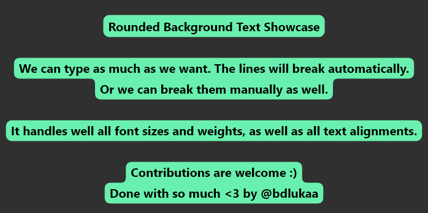
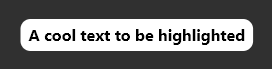
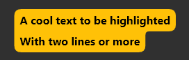
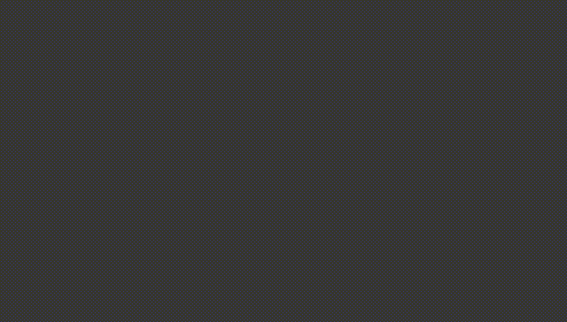
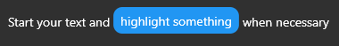

<div>
  <h1 align="center">rounded_background_text</h1>
  <p align="center" >
    <a title="Discord" href="https://discord.gg/674gpDQUVq">
      
    </a>
    <a title="Pub" href="https://pub.dartlang.org/packages/rounded_background_text" >
      
    </a>
    <a title="Github License">
      
    </a>
  </p>
  <p align="center">
  Highlight text with rounded corners
  </p>
</div>

## Features

- ✅ Highlight Text
- ✅ Highlight Text Field
- ✅ Highlight Text Span



## Getting started

Import the package:

```dart
import 'package:rounded_background_text/rounded_background_text.dart';
```

## Usage

### Highlight a simple text:

```dart
RoundedBackgroundText(
  'A cool text to be highlighted',
  style: const TextStyle(fontWeight: FontWeight.bold),
  backgroundColor: Colors.white,
),
```



Multiline text is also supported

```dart
RoundedBackgroundText(
  'A cool text to be highlighted\nWith two lines or more',
  style: const TextStyle(fontWeight: FontWeight.bold),
  backgroundColor: Colors.amber,
),
```



### Highlight a TextField:

You must use a `TextEditingController`

```dart
final controller = TextEditingController();

RoundedBackgroundTextField(
  controller: controller, // required
  backgroundColor: Colors.blue,
  style: const TextStyle(fontWeight: FontWeight.bold),
  textAlign: TextAlign.center,
),
```

The text will be highlighted as the user types



### Highlight a text span:

```dart
RichText(
  text: TextSpan(
    text: 'Start your text and ',
    children: [
      RoundedBackgroundTextSpan(
        text: 'highlight something',
        backgroundColor: Colors.blue,
      ),
      const TextSpan(text: ' when necessary'),
    ],
  ),
),
```



## You may like to know:

You can change the radius of the corners by setting `innerRadius` and `outerRadius`:

```dart
RoundedBackgroundText(
  'A cool text to be highlighted',
  style: const TextStyle(fontWeight: FontWeight.bold),
  backgroundColor: Colors.white,
  innerRadius: 15.0,
  outerRadius: 10.0,
),
```

The max allowed value is `20.0`. The min is `0.0`

## Contribution

Feel free to [file an issue](https://github.com/bdlukaa/rounded_background_text/issues/new) if you find a problem or [make pull requests](https://github.com/bdlukaa/rounded_background_text/pulls).

All contributions are welcome!
